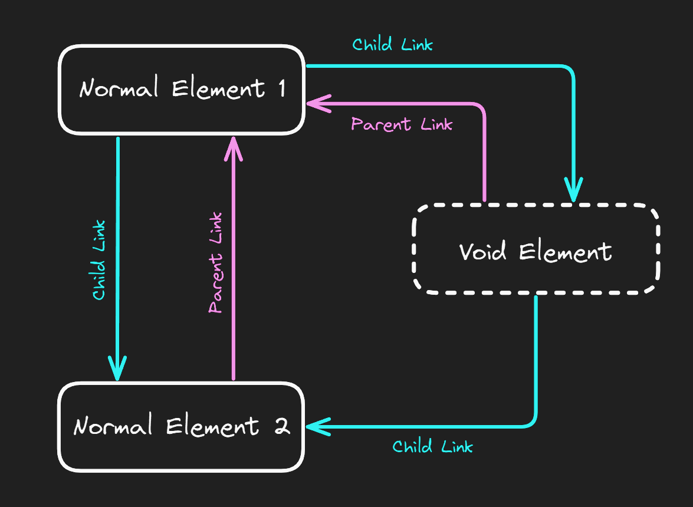

#System
### Hierarchical structure

* **Core Component**
	* Rig Element
	* Rig Element:
		* Rig Element
		* ...
	* ...

MPAS Rig structure can be interpreted as a hierarchical tree-like graph, where [Core Component](Rig%20Core%20Component.md) is the root. Direct children of the Core are referred to as **Core Elements**.

Rig Elements enter Parent-Child relationships, where each element can have any number of children, but only one parent. Rig Elements address each other with unique names, assigned to them by Unreal Engine. **Core Elements** specify there parent as `"Core"`.

There exist several types of Rig Elements and not every type can play the role of a **Core Element**.

### Types of Elements

#### 1. Body Segment
The simplest type that represents a bone in the main body of the mesh (not a limb). Usually used as a **Core Element**. Does not contain it's own means of movement, but rather defines a *Desired Transform* (Location and Rotation) which is then used by **Movement Elements**. See more in [Body Segment - Element](../Content/Elements/Body%20Segment%20-%20Element.md).

#### 2. Movement Elements
Rig elements that introduce movement capabilities into the rig. Such elements need to be attached to **Body Segments** in order to access it's *Desired Transform*. Movement elements attempt to move the parent **Body Segment** in a way, that makes it follow it's *Desired Transform*. Multiple movement elements can be attached to a single **Body Segment** and communicate with each other using [Custom Parameters](../Systems/Custom%20Parameters.md) or direct linking (performed on the *Linking* stage of rig setup, see more in [MPAS Handler](MPAS%20Handler.md)).

#### 3. Position Drivers
Special elements that simultaneously control positions of one or multiple child elements. Can be used as **Core Elements**. When controlling **Body Segments** affect the *Desired Transform*. See more in [Position Driving](../Systems/Position%20Driving.md).

#### 4. Visual Elements
Purely decorative elements, that do not introduce/initiate movement (for example: [Limb - Element](../Content/Elements/Visual/Limb%20-%20Element.md)). Such elements are often implemented as *Void Elements*.

### Void Elements

Rig elements, that are not incorporated into standard "Parent-Child" relationship.

The following hierarchy:
* Normal Element 1
	* *Void Element*
		* Normal Element 2
In fact looks like this:

*Child Link* - targeted element is a child of the origin one;
*Parent Link* - targeted element is a parent of the origin one.

This way, Normal Element 2 is not aware of the existence of the Void element and can directly address Normal Element 1 as it's parent.
